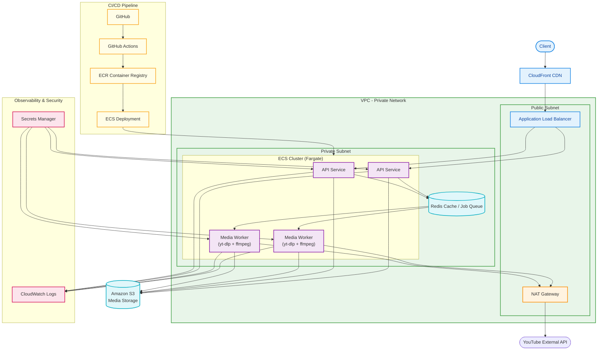

# wav-audio-converter

Downloads audio from a YouTube URL, trims it to a specified time range, and returns it as a `.wav` file.

## Tech stack

- **Runtime**: Node.js, Express 5
- **Queue**: BullMQ + Redis (AWS ElastiCache in production)
- **File storage**: AWS S3 (presigned URLs for client download)
- **Logging**: Winston + CloudWatch
- **Testing**: Jest + Supertest
- **CI/CD**: GitHub Actions → AWS ECR + ECS
- **Deployment**: Docker, AWS ECS (Fargate)
- **Audio processing**: `yt-dlp`, `ffmpeg`

## Prerequisites

- Node.js 18+
- `yt-dlp` installed and on PATH
- `ffmpeg` installed and on PATH
- Redis (local or via Docker)

## Getting started

```bash
cd backend
cp .env.example .env   # set PORT, REDIS_URL, AWS_S3_BUCKET, NODE_ENV
npm install
npm run dev
```

With Docker:
```bash
docker compose up --build
```

## Testing

```bash
npm test           # run all tests
npm run test:watch # watch mode
```

## API

### `POST /api/audio`

Enqueues a download and trim job. Returns immediately with a `jobId`.

**Body**
```json
{
  "url": "https://www.youtube.com/watch?v=...",
  "start": "00:00:10",
  "end": "00:00:30"
}
```

**Response**
```json
{ "jobId": "abc123" }
```

### `GET /api/audio/:jobId/status`

Returns the current job state.

```json
{ "state": "waiting" | "active" | "completed" | "failed" }
```

### `GET /api/audio/:jobId/download`

Redirects to a presigned S3 URL to download the `.wav` file. Only available when state is `completed`.

### `GET /health`

Returns 200. Used by ECS for container health checks.

## Architecture

The API and worker run as separate containers/ECS tasks and communicate via a BullMQ queue backed by Redis.

- **API container**: handles HTTP, enqueues jobs, issues presigned S3 URLs. Does not run `yt-dlp` or `ffmpeg`.
- **Worker container**: picks up jobs, runs `yt-dlp` + `ffmpeg`, uploads the trimmed file to S3, stores the S3 key as the job result.

Files never pass through the API — clients download directly from S3 via presigned URLs. The worker handles `SIGTERM` gracefully, draining the current job before shutdown.



## CI/CD

Every PR runs lint and tests via GitHub Actions. Merging to `main` triggers a full deploy: Docker images are built, pushed to ECR, and ECS tasks are updated with a rolling deploy.

## Implementation roadmap

- [x] Routes / controllers / services separation
- [x] Winston logger + Morgan + request ID middleware + error handler + helmet
- [x] BullMQ queue + worker (concurrency limit + graceful shutdown)
- [x] Input validation for `start`/`end` timestamps
- [x] Rate limiting on `POST /api/audio` (Redis-backed)
- [ ] S3 upload + presigned URL download + health check endpoint
- [ ] Tests (Jest + Supertest, unit + integration)
- [ ] CI/CD (GitHub Actions — PR checks + deploy pipeline)
- [ ] Docker (separate Dockerfiles for API and worker)
- [ ] AWS (ECS + ElastiCache + S3 + CloudWatch + Secrets Manager)
